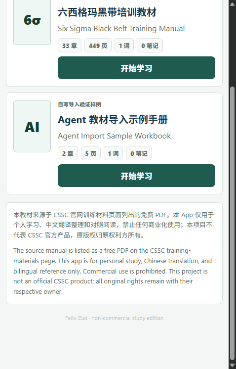
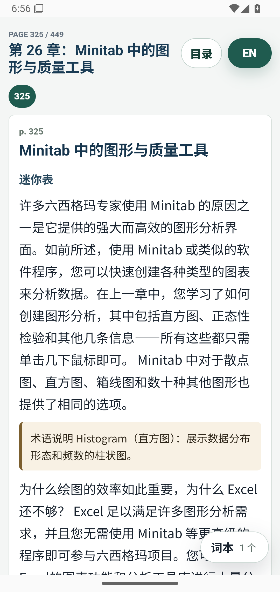
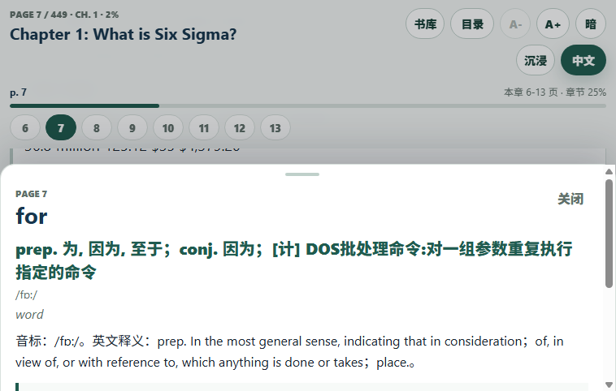
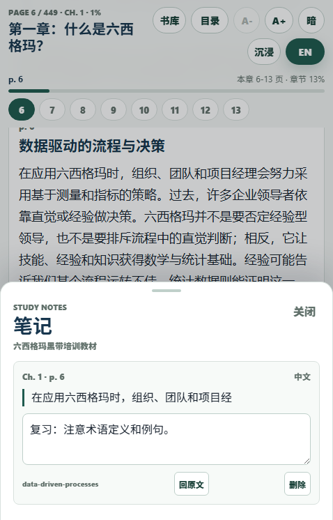
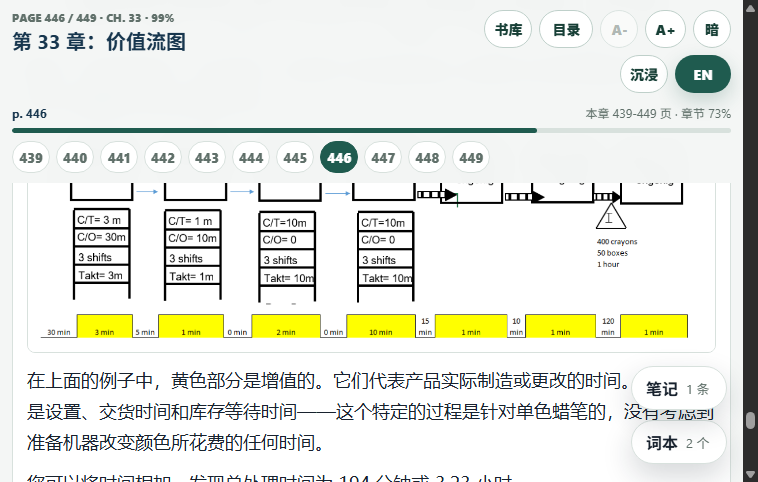
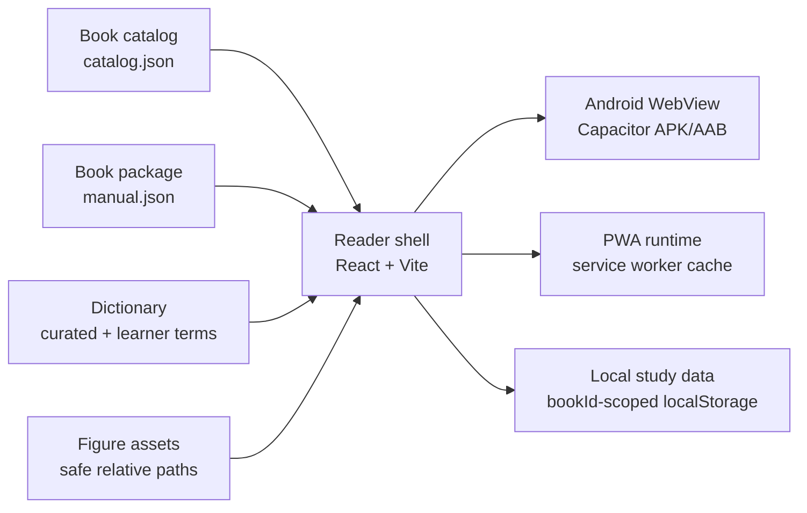
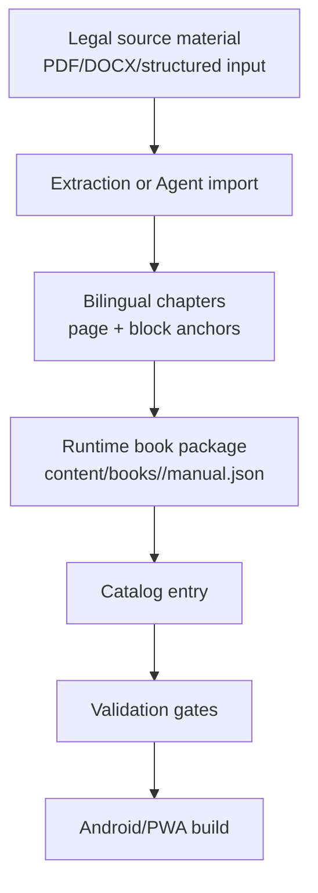

# Six Sigma Study App

[](https://github.com/Felix-Zuo/six-sigma-study-app/actions/workflows/ci.yml)

A local-first Android/PWA bilingual textbook study platform that turns legally usable technical manuals into aligned reading, tap-to-lookup vocabulary, notes, and review workflows.

The first full book is a non-commercial Chinese-English study edition of the CSSC Six Sigma Black Belt training manual. A second synthetic sample book proves the Agent import contract and multi-book runtime path.

This is not an official CSSC product. The bundled manual-derived content is for personal study, Chinese translation, and bilingual reference only. Commercial use is prohibited.

## Product Snapshot

| Metric | Current State |
| --- | --- |
| Runtime books | 2 catalog books: full Six Sigma manual + synthetic Agent import sample |
| Six Sigma content | 33 chapters, 449 aligned study pages, 174 reader sections |
| Preserved assets | 470 figure/table/formula PNG runtime assets |
| Dictionary | 3954 local entries, curated Six Sigma terms first |
| Platforms | Android APK/AAB via Capacitor, PWA runtime for browser QA |
| Study data | `bookId`-scoped reading position, vocabulary, notes, and source anchors |
| Public gates | content validation, Agent book contract validation, public-readiness audit, CI |

## Screenshots

| Library | Reader | Lookup |
| --- | --- | --- |
|  |  |  |

| Notes | Figure Preservation |
| --- | --- |
|  |  |

## Study Workflow

1. Open the Android app and accept the bilingual non-commercial source notice.
2. Choose a book from the library.
3. Switch English/Chinese at any time; the reader restores the same section/block when possible.
4. Tap an English word or selected phrase to open the half-screen explanation sheet.
5. Save terms to the local vocabulary book or save selected text as notes.
6. Return from vocabulary/notes back to the exact source page and block.

When another book is selected, vocabulary and notes are filtered to that book. Legacy localStorage records from the first book are migrated to `six-sigma-black-belt`.

## Core Features

- Multi-book catalog and home/library screen.
- Opening logo and bilingual rights/non-commercial notice.
- English/Chinese reading mode with block-aware position restoration.
- Deduplicated page rail, chapter progress, page search, and table-of-contents navigation.
- Immersive reading mode with Android back-button handling.
- Bottom-sheet lookup with scroll containment, so sheet scrolling does not drag the reader behind it.
- Curated terms, learner dictionary entries, phrase lookup, vocabulary review scheduling, and CSV export.
- Selected-text notes with source return actions.
- Offline Android packaging with generated figures bundled in APK/AAB.
- Agent textbook import contract for future legally usable books.

## Architecture



More system diagrams: [docs/09-showcase-systems.md](docs/09-showcase-systems.md).

## Content Pipeline



The Six Sigma profile remains strict for the complete manual. The generic Agent import path validates future books without depending on the Six Sigma 33-chapter constants.

## Agent Textbook Import

Future textbook Agents should follow [docs/agent-import.md](docs/agent-import.md).

| Contract Piece | Path |
| --- | --- |
| Agent input schema | `content/schemas/agent-import-request.schema.json` |
| Book package schema | `content/schemas/book-package.schema.json` |
| Sample request | `samples/agent-import/sample-book-request.json` |
| Sample book source package | `content/books/agent-import-sample/manual.json` |
| Runtime sample package | `apps/reader/public/content/books/agent-import-sample/manual.json` |
| Validator | `scripts/import_book_agent_contract.py` |

Validation:

```powershell
npm run lint:books
npm run qa:book-import
```

The sample book is original synthetic content. It exists to prove that a new book can enter the library through catalog/package files without changing the reader core.

## Public Rights Boundary

- CSSC training-materials page: https://www.sixsigmacouncil.org/six-sigma-training-material/
- Listed file: `CSSC Lean Six Sigma Black Belt Certification Training Manual.pdf`
- Project use: personal study, Chinese translation organization, bilingual reference, and non-commercial portfolio demonstration.
- Not allowed: commercial use, paid redistribution, paid training use, resale, or implication of official endorsement.
- Original rights: original manual text, figures, tables, and course material remain owned by their original rights holder.

Public-readiness evidence: [PUBLIC_READINESS.md](PUBLIC_READINESS.md). Attribution and third-party notices: [ATTRIBUTION.md](ATTRIBUTION.md), [NOTICE.md](NOTICE.md), [THIRD_PARTY_NOTICES.md](THIRD_PARTY_NOTICES.md).

## Validation Matrix

| Area | Command / Evidence | Coverage |
| --- | --- | --- |
| Six Sigma content | `npm run lint:content` | 33 chapters, 449 pages, block page anchors, assets, dictionary lookup uniqueness |
| Agent books | `npm run lint:books` | Agent request, generic book packages, catalog uniqueness, sample import |
| Public safety | `npm run audit:public` | denylisted tracked files and runtime JSON local-path scan |
| Source coverage | `npm run qa:source-coverage` | source TOC anchors, assets, sampled nonblank source renders |
| Reader UX | `npm run qa:multibook-ux` | notice, home, page search, book-scoped vocab, scroll lock, immersive mode |
| Android WebView | `npm run qa:android-key-chapters` | Chapters 1, 7, 26, 33, lookup, alignment, image checks |
| Release package | `npm run android:release-apk` and `npm run android:aab` | local signed APK/AAB with runtime content bundled |

Detailed evidence: [docs/08-release-verification.md](docs/08-release-verification.md).

## Android Install / Build

Release outputs are generated locally:

```text
C:\findjob_sixsigma_app\android\app\build\outputs\apk\release\app-release.apk
C:\findjob_sixsigma_app\android\app\build\outputs\bundle\release\app-release.aab
```

Build sequentially:

```powershell
npm install
npm run android:release-apk
npm run android:aab
```

Release signing uses ignored local files:

- `android\keystore.properties`
- external keystore such as `C:\findjob_sixsigma_secrets\sixsigma-release.jks`

Do not commit signing files.

## Local Development

```powershell
npm install
npm run lint:content
npm run lint:books
npm run audit:public
npm run typecheck
npm run build
npm run dev
```

The full Six Sigma extraction profile expects local source files outside Git, normally under `C:\findjob_sixsigma_sources`:

- aligned English DOCX
- aligned Chinese DOCX
- source PDF for source-coverage QA
- ECDICT CSV for dictionary subset generation

The source files are not committed. Runtime JSON uses public-safe provenance fields instead of local source paths.

## Key Folders

- `apps/reader`: React/Vite reader wrapped by Capacitor for Android.
- `apps/reader/public/content`: public runtime catalog, book packages, and figure assets.
- `content/books`: source-controlled generic book packages for Agent import fixtures.
- `content/processed`: generated Six Sigma content and processed catalog.
- `content/schemas`: content, Agent request, and book package contracts.
- `scripts`: extraction, validation, QA, import-contract, and public-audit tooling.
- `docs`: architecture, pipeline, release verification, showcase systems, and research notes.

## Known Limits

- Sentence-level semantic alignment is not separately modeled; current restoration is section/block-level.
- Full OCR/PDF layout reconstruction is not part of the Agent sample yet.
- Physical long-press QA on a real phone remains separate from WebView/CDP checks.
- The offline dictionary is scoped to this manual and curated terms, not a full arbitrary English dictionary.
- Some extracted tables intentionally remain images when that preserves fidelity better than rebuilding them.

## Roadmap

- Add a real `--input-manifest --report-json` converter around the Agent import contract.
- Add highlighted rendering for saved notes.
- Improve curated section mapping for the remaining normal-paragraph source headings.
- Profile low-end Android devices.
- Add optional sync/export workflows after the local-first model is stable.

## Author

Author profile: https://github.com/Felix-Zuo
