# Six Sigma Study App

[](https://github.com/Felix-Zuo/six-sigma-study-app/actions/workflows/ci.yml)

A local-first Android/PWA bilingual textbook study platform that turns legally usable technical manuals into aligned reading, tap-to-lookup vocabulary, notes, and review workflows.

The first full book is a non-commercial Chinese-English study edition of the CSSC Six Sigma Black Belt training manual. A second original import-practice workbook proves the Agent import contract and multi-book runtime path.

This is not an official CSSC product. The bundled manual-derived content is for personal study, Chinese translation, and bilingual reference only. Commercial use is prohibited.

## Product Snapshot

| Metric | Current State |
| --- | --- |
| Release | `Beta 0.8.11` (`0.8.11-beta.0`, Android code `811`) |
| Runtime books | 2 catalog books: full Six Sigma manual + original import-practice workbook |
| Six Sigma content | 33 chapters, 449 aligned study pages, 174 reader sections |
| Preserved assets | 475 figure/table/formula PNG runtime assets; EN/ZH image counts 476/476 |
| Dictionary | 3980 public offline entries; local Android builds add a 3550-entry private-question supplement |
| Context glossary | 3875 English text blocks, 8591 aligned sentences, 105048 occurrence-level meanings |
| AI study assistance | Optional personal DeepSeek V4 Flash key for context review, selected-text explanation, and question coaching |
| Practice | 1006 questions in local Android release; browse/practice/wrong/exam modes |
| Platforms | Android APK/AAB via Capacitor, PWA runtime for browser QA |
| Study data | `bookId`-scoped reading position, vocabulary, notes, source anchors, streaks, question progress |
| Public gates | content/schema audits, private-artifact isolation, browser interaction QA, Android debug compile |

## Screenshots

| Study Home | Chinese Reader With Figure | Lookup Half Sheet |
| --- | --- | --- |
| 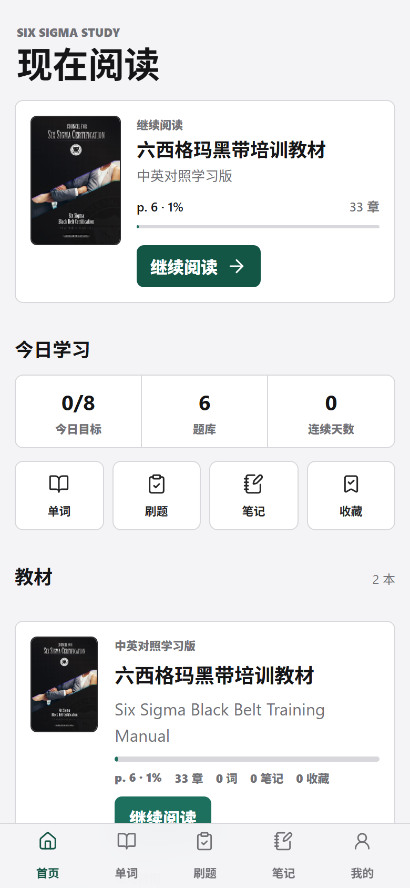 |  | 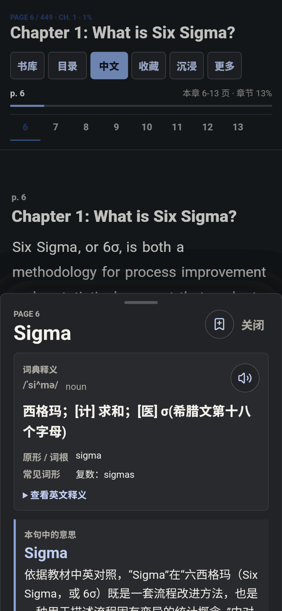 |

| Opening | Lookup Full Sheet | Vocabulary |
| --- | --- | --- |
| 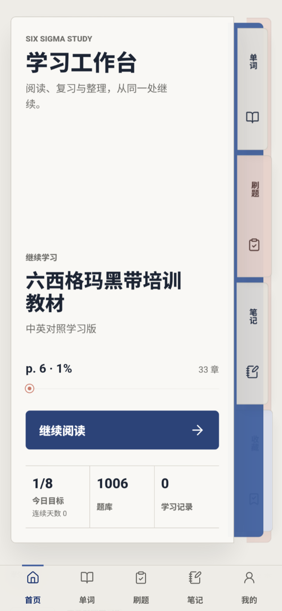 | 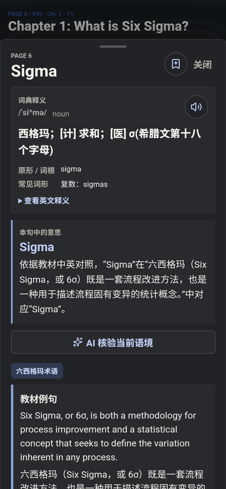 | 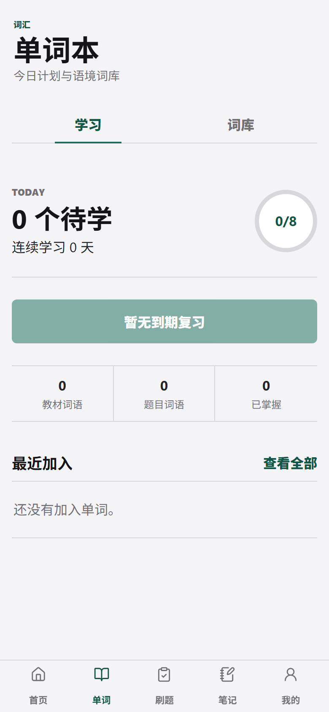 |

| Notes | Favorites | English Reader |
| --- | --- | --- |
|  | 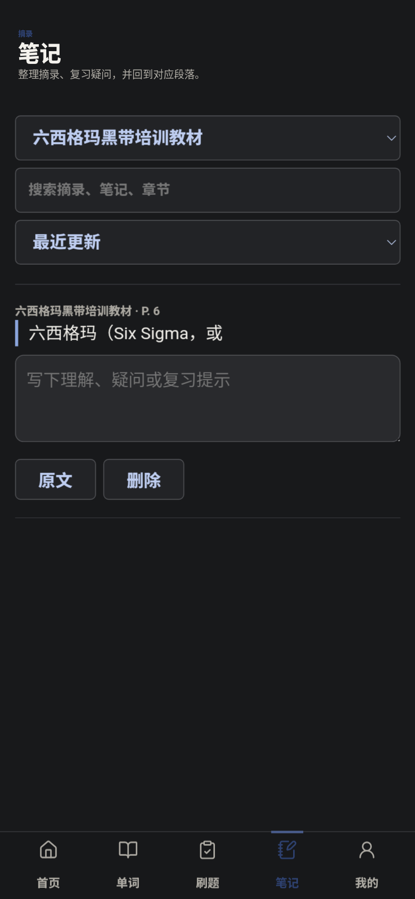 | 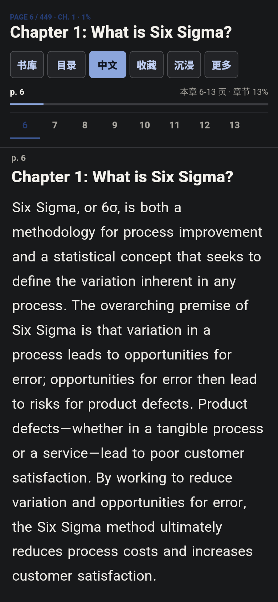 |

| Import Practice Book | Table of Contents | Settings |
| --- | --- | --- |
| 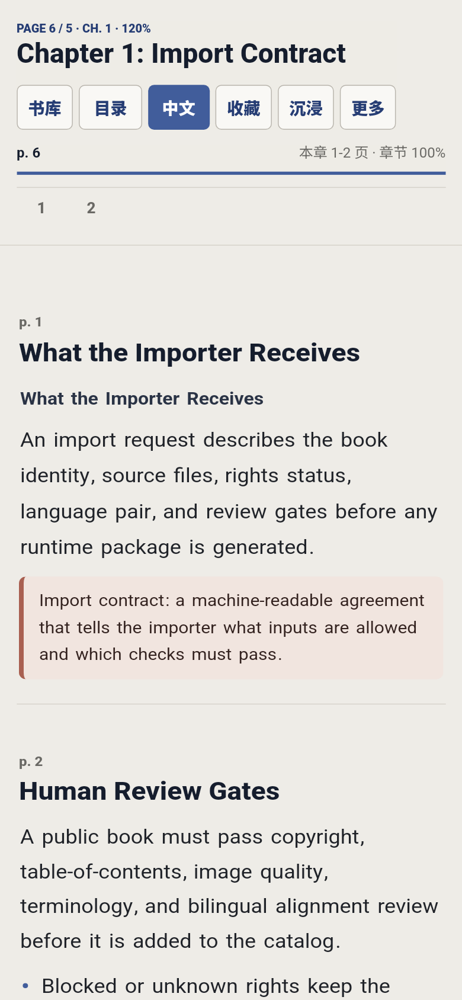 | 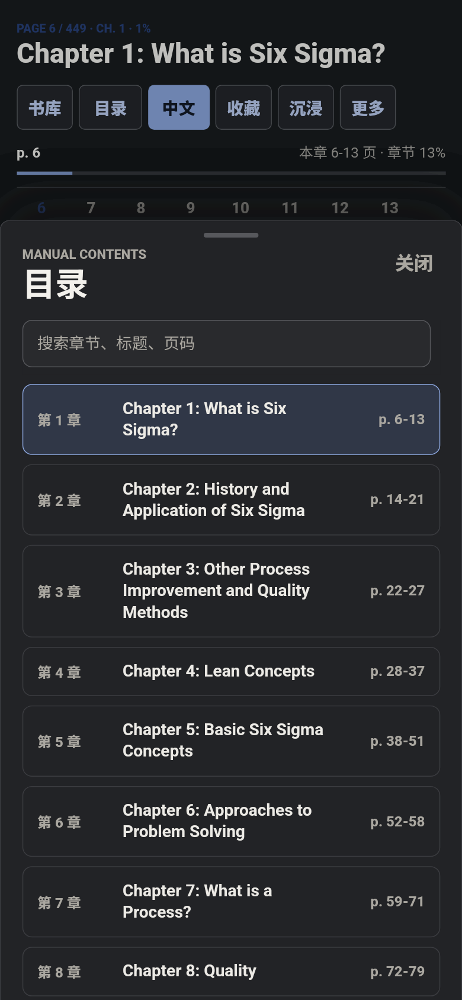 | 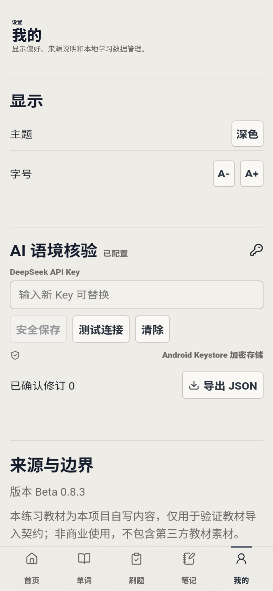 |

| Dictionary-First Review | Question Training | Rich Question Word Lookup |
| --- | --- | --- |
| 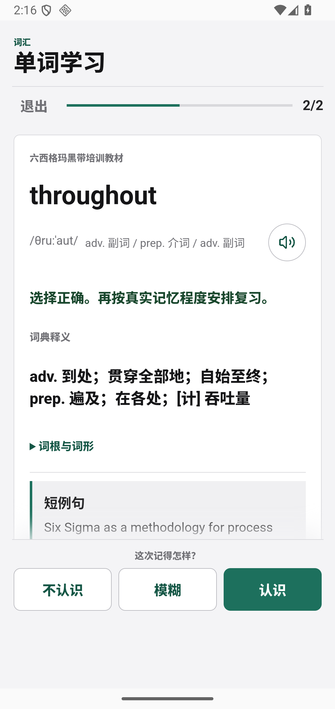 | 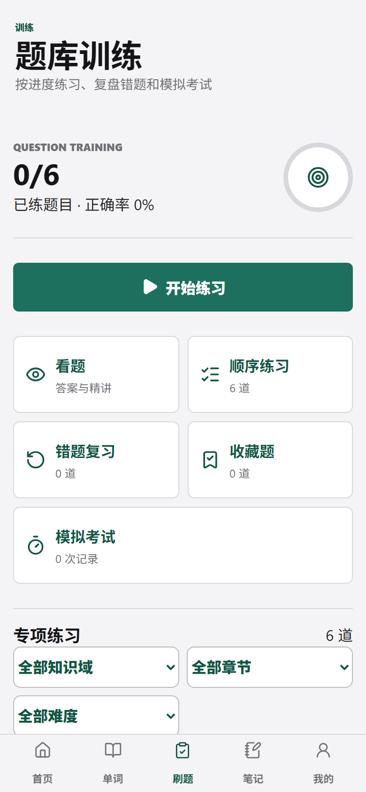 | 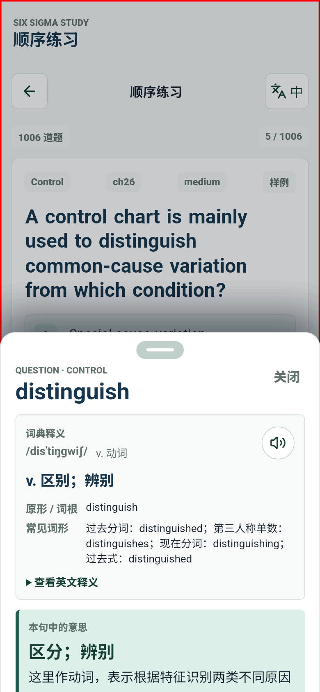 |

Beta 0.8.9 removes the folder metaphor and real-time 3D transition stage. The home screen now follows a familiar reading-product hierarchy: Now Reading, Today's Study, Library, and Recent Notes. Navigation uses one live route shell and short opacity fades, so headings and body text are never stretched, duplicated, or moved between layers. A real source cover, neutral surfaces, one restrained accent, and a stable five-item navigation bar keep attention on study content. See [design-qa.md](design-qa.md) for the review record.

## Study Workflow

1. Open the Android app; the logo opening runs automatically and then enters the study home.
2. Continue the current book or open another book from the library.
3. Switch English/Chinese at any time; the reader restores the same section/block when possible.
4. Tap an English word or selected phrase to open the draggable explanation sheet.
5. Save terms, notes, and favorites locally.
6. Review vocabulary, notes, and favorites from their own bottom-navigation pages, then jump back to the exact source page and block.

When another book is selected, vocabulary, notes, and favorites are filtered to that book. Legacy localStorage records from the first book are migrated to `six-sigma-black-belt`.

## Core Features

- Multi-book reading home with bottom navigation for Home, Vocabulary, Practice, Notes, and Settings; Favorites remains available from home and reader tools.
- Quiet, content-first interface with a real book cover, flat study summaries, familiar reading hierarchy, and short opacity-only route transitions. Native text is never scaled, stretched, or duplicated.
- Automatic opening logo animation with the full rights/non-commercial notice moved to Settings/About.
- English/Chinese reading mode with block-aware position restoration.
- Deduplicated page rail, chapter progress, page search, and table-of-contents navigation.
- Chapter-end completion controls persist a per-book read state and continue directly to the next chapter.
- Immersive reading mode with Android back-button handling.
- Draggable bottom-sheet lookup with half, tall, and full-height states plus scroll containment.
- Rich offline word profiles with phonetics, pronunciation, part of speech, semicolon-separated senses, lemma/word forms, English definitions, occurrence-level meanings derived from the aligned bilingual sentence, bilingual examples, source return, and CSV export.
- Context lookup never promotes the first broad dictionary sense to a sentence meaning. Low-confidence or unavailable alignments are labeled honestly, while six cross-block/page-break sentences are restored before lookup.
- Optional DeepSeek V4 Flash assistance supports three bounded actions: verify one lookup context, explain an explicitly selected reading passage, or coach one question. Each action sends only the active learning fragment, returns a strict validated structure, and keeps offline content as the source of truth.
- Reading explanations include a concise translation, plain-English restatement, relevant terms, and one grammar cue. Question coaching identifies the answer, concept, option-by-option reasoning, common trap, and review cue without exposing hidden model reasoning.
- Reading/question AI results are cached locally by a deterministic request identity; reopening the same material avoids a duplicate request, and the cache never contains the API key.
- Android stores the user's DeepSeek API key with AES-GCM backed by Android Keystore. Browser/PWA testing keeps a key in memory for the current session only; keys never enter localStorage, correction exports, logs, or Git.
- Every generated proposal is normalized into `Context Correction Bundle v1`; exact phrase structures can reuse an accepted correction automatically, while merely similar contexts remain suggestions requiring confirmation.
- Android pronunciation uses the device's native English text-to-speech engine; browser builds retain a Web Speech fallback.
- Phrase-aware flashcard review uses canonical dictionary meanings for recall, keeps context/AI explanations separate, underlines the target in a short bilingual example, records the exact source occurrence, and keeps the three memory ratings fixed within thumb reach.
- Daily local streak target with capped catch-up workload after missed days.
- Independent vocabulary, notes, and favorites pages with book filters, search, sorting, and source return actions.
- Question practice workspace with Browse, Practice, Wrong Questions, Favorites, and Mock Exam modes; submitted questions stay on their explanation until the learner explicitly continues.
- Private question-bank JSON import for local user-provided study material; full private banks stay outside Git.
- Chinese mode preserves figure, table, and formula images rather than falling back to text-only reading.
- Offline Android packaging with generated figures bundled in APK/AAB.
- Agent textbook import contract for future legally usable books.

## Architecture

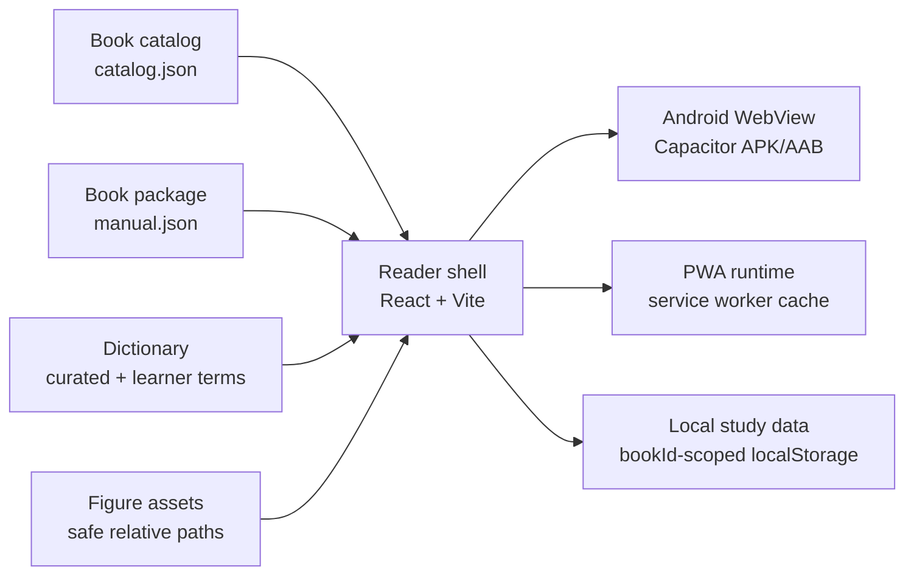
```mermaid
flowchart LR
  A["Book catalog<br/>catalog.json"] --> B["Reader shell<br/>React + Vite"]
  C["Book package<br/>manual.json"] --> B
  D["Dictionary<br/>curated + learner terms"] --> B
  E["Figure assets<br/>safe relative paths"] --> B
  B --> F["Android WebView<br/>Capacitor APK/AAB"]
  B --> G["PWA runtime<br/>service worker cache"]
  B --> H["Local study data<br/>bookId-scoped localStorage"]
```

More system diagrams: [docs/09-showcase-systems.md](docs/09-showcase-systems.md).

## AI Study Assistance

The AI feature is a set of bounded study actions rather than an open-ended chat surface. Configure a personal key under **我的 > AI 学习助教**. Use **AI 核验当前语境** inside a word sheet, select an English passage and choose **AI 简释**, or choose **AI 精讲** on a question. Requests are explicit, size-bounded, and validated before rendering.

| Contract Piece | Path |
| --- | --- |
| Persistent/export schema | `content/schemas/context-correction-bundle.schema.json` |
| Accepted repository records | `content/corrections/accepted-context-corrections.json` |
| App store and exact/similar matching | `apps/reader/src/lib/contextCorrectionStore.ts` |
| Reading/question result cache | `apps/reader/src/lib/aiStudyCache.ts` |
| Strict DeepSeek request adapter | `apps/reader/src/lib/deepSeekAssistant.ts` |
| Android Keystore/network bridge | `android/app/src/main/java/com/findjob/sixsigmastudy/NativeDeepSeekAssistantPlugin.java` |
| Import and runtime merge | `scripts/import_context_corrections.py`, `scripts/apply_context_corrections.py` |

Import an App-exported, user-confirmed bundle and apply it to runtime context glosses:

```powershell
python scripts\import_context_corrections.py path\to\context-corrections.json
npm run apply:context-corrections
npm run qa:context-corrections
```

Import validates the schema, exact field set, source sentence SHA-256, phrase presence, user confirmation, block/sentence anchor, and book ID against the current manual before writing. Question-source corrections stay local and are skipped by the public repository importer so private question text cannot leak into Git.

## Content Pipeline

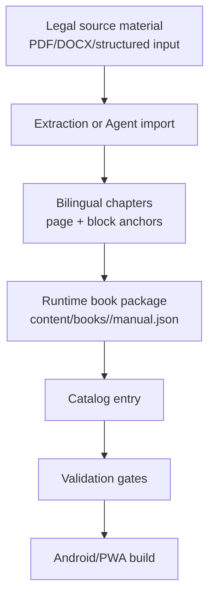
```mermaid
flowchart TD
  A["Legal source material<br/>PDF/DOCX/structured input"] --> B["Extraction or Agent import"]
  B --> C["Bilingual chapters<br/>page + block anchors"]
  C --> D["Runtime book package<br/>content/books/<bookId>/manual.json"]
  D --> E["Catalog entry"]
  E --> F["Validation gates"]
  F --> G["Android/PWA build"]
```

The Six Sigma profile remains strict for the complete manual. The generic Agent import path validates future books without depending on the Six Sigma 33-chapter constants.

## Agent Textbook Import

Future textbook Agents should follow [docs/agent-import.md](docs/agent-import.md).

| Contract Piece | Path |
| --- | --- |
| Agent input schema | `content/schemas/agent-import-request.schema.json` |
| Book package schema | `content/schemas/book-package.schema.json` |
| Sample request | `samples/agent-import/sample-book-request.json` |
| Sample book source package | `content/books/agent-import-sample/manual.json` |
| Runtime sample package | `apps/reader/public/content/books/agent-import-sample/manual.json` |
| Validator | `scripts/import_book_agent_contract.py` |

Validation:

```powershell
npm run lint:books
npm run qa:book-import
```

The sample book is original synthetic content. It exists to prove that a new book can enter the library through catalog/package files without changing the reader core.

## Question Practice

The committed question path contains only schema, import tooling, and small original public samples:

| Contract Piece | Path |
| --- | --- |
| Question-bank schema | `content/schemas/question-bank.schema.json` |
| Public sample questions | `samples/question-bank/public-sample.questions.json` |
| Private PDF importer | `scripts/import_ucourse_question_bank.py` |
| Learning-module QA | `npm run qa:learning-modules` |

Private imports are written outside the repository under `D:\0A OpenClaw\projects\6sigma\private-question-bank`. Local Android builds stage the private bank into an ignored runtime asset, while the public repository retains only schema, tooling, and original samples. The file picker remains available for another user-owned local bank.

## Public Rights Boundary

- CSSC training-materials page: https://www.sixsigmacouncil.org/six-sigma-training-material/
- Listed file: `CSSC Lean Six Sigma Black Belt Certification Training Manual.pdf`
- Project use: personal study, Chinese translation organization, bilingual reference, and non-commercial portfolio demonstration.
- Not allowed: commercial use, paid redistribution, paid training use, resale, or implication of official endorsement.
- Original rights: original manual text, figures, tables, and course material remain owned by their original rights holder.

Public-readiness evidence: [PUBLIC_READINESS.md](PUBLIC_READINESS.md). Attribution and third-party notices: [ATTRIBUTION.md](ATTRIBUTION.md), [NOTICE.md](NOTICE.md), [THIRD_PARTY_NOTICES.md](THIRD_PARTY_NOTICES.md).

## Validation Matrix

| Area | Command / Evidence | Coverage |
| --- | --- | --- |
| Six Sigma content | `npm run lint:content` | 33 chapters, 449 pages, block page anchors, assets, dictionary lookup uniqueness |
| Agent books | `npm run lint:books` | Agent request, generic book packages, catalog uniqueness, sample import |
| Public safety | `npm run audit:public` | denylisted tracked files and runtime JSON local-path scan |
| Source coverage | `npm run qa:source-coverage` | source TOC anchors, assets, sampled nonblank source renders |
| Reviewed fidelity | `npm run qa:content-fidelity-reviewed` | P0/P1=0, no flattened-table or EN/ZH table/image count regression |
| Reader UX | `npm run qa:multibook-ux` | notice, home, page search, book-scoped vocab, scroll lock, immersive mode |
| Target 3 product UX | `npm run qa:target3-product`, `npm run qa:notes`, `npm run qa:image-fidelity` | auto opening, bottom navigation, independent study pages, draggable sheets, Chinese image fidelity |
| Target 4 product audit | `npm run qa:target4-flow` | opening, home, second book, settings, TOC, immersive, lookup half/full, source return, Chinese image fidelity, notes, favorites, vocabulary |
| Learning modules | `npm run qa:learning-modules` | flashcards, occurrence-level context glossary, streak, question schema, question modes, question word lookup, private-bank isolation |
| Learning UI | `npm run qa:learning-ui` | recall-first word review, contextual answer, question lookup, unknown explanation, correct auto-next |
| Lexical learning | `npm run qa:lexical-learning`, `npm run qa:lexical-ui` | rich senses, phonetics, context disambiguation, bilingual examples, native pronunciation bridge, mobile layout |
| Vocabulary study UX | `npm run qa:vocab-study-ux` | legacy phrase migration, dictionary-only quiz answers, exact source ranges, short underlined examples, persisted AI supplements, fixed rating dock |
| AI context corrections | `npm run qa:context-corrections`, `npm run qa:ai-context-ui` | strict output, hashes, accepted-only export, revert regression, mobile proposal/accept/reuse flow |
| Android WebView | `npm run qa:android-key-chapters` | Chapters 1, 7, 26, 33, lookup, alignment, image checks |
| Release package | `npm run android:release-apk` and `npm run android:aab` | local signed APK/AAB with runtime content bundled |

Detailed evidence: [docs/08-release-verification.md](docs/08-release-verification.md).

## Android Install / Build

Release outputs are generated locally:

```text
D:\0A OpenClaw\projects\6sigma\six-sigma-study-app\android\app\build\outputs\apk\release\app-release.apk
D:\0A OpenClaw\projects\6sigma\six-sigma-study-app\android\app\build\outputs\bundle\release\app-release.aab
```

Build sequentially:

```powershell
npm install
npm run android:release-apk
npm run android:aab
```

Release signing uses ignored local files:

- `android\keystore.properties`
- external keystore such as `D:\0A OpenClaw\projects\6sigma\secrets\sixsigma-release.jks`

Do not commit signing files.

## Local Development

```powershell
npm install
npm run lint:content
npm run lint:books
npm run audit:public
npm run typecheck
npm run build
npm run qa:learning-modules
npm run dev
```

The full Six Sigma extraction profile expects local source files outside Git, normally under `D:\0A OpenClaw\projects\6sigma\sources`:

- aligned English DOCX
- aligned Chinese DOCX
- source PDF for source-coverage QA
- ECDICT CSV for dictionary subset generation

The source files are not committed. Runtime JSON uses public-safe provenance fields instead of local source paths.

## Key Folders

- `apps/reader`: React/Vite reader wrapped by Capacitor for Android.
- `apps/reader/public/content`: public runtime catalog, book packages, and figure assets.
- `content/books`: source-controlled generic book packages for Agent import fixtures.
- `content/processed`: generated Six Sigma content and processed catalog.
- `content/schemas`: content, Agent request, and book package contracts.
- `samples/question-bank`: safe original public sample questions for schema and UI QA.
- `scripts`: extraction, validation, QA, import-contract, and public-audit tooling.
- `docs`: architecture, pipeline, release verification, showcase systems, and research notes.

## Known Limits

- Sentence-level semantic alignment is not separately modeled; current restoration is section/block-level.
- The local UCOURSE 1000-question source is English. Question language switching falls back to English where the private bank has no reviewed Chinese field; the committed original samples are bilingual.
- The reviewed content-fidelity gate is P0/P1 clean. Thirty-one P2 advisories remain for number/symbol formatting and URL/formula-heavy text; they are not confirmed content errors.
- Full OCR/PDF layout reconstruction is not part of the Agent sample yet.
- Physical long-press QA on a real phone remains separate from WebView/CDP checks.
- The offline dictionary is scoped to this manual and curated terms, not a full arbitrary English dictionary.
- Some extracted tables intentionally remain images when that preserves fidelity better than rebuilding them.

## Roadmap

- Add a real `--input-manifest --report-json` converter around the Agent import contract.
- Refine inline note highlight ranges beyond current source-block markers.
- Improve curated section mapping for the remaining normal-paragraph source headings.
- Profile low-end Android devices.
- Add optional sync/export workflows after the local-first model is stable.

## Author

Author profile: https://github.com/Felix-Zuo
