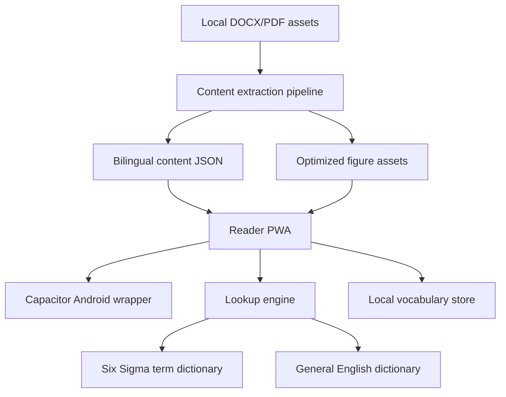

# Architecture

## High-Level Shape

## App Layers

### Reader Shell

- chapter navigation
- page and paragraph rendering
- floating language toggle
- scroll restoration
- bottom-sheet lookup UI

### Content Runtime

- loads chapter JSON
- renders paragraph pairs
- renders figures at the right page/paragraph position
- exposes current paragraph/page to lookup and vocabulary features

### Lookup Engine

- tokenizes visible English text
- detects single-word taps
- supports phrase selection
- resolves terms in priority order

### Vocabulary Store

- local-first persistence
- source metadata
- review status
- future spaced repetition scheduling

## Data Flow

1. Pipeline extracts bilingual paragraphs and figure assets.
2. Pipeline emits validated chapter JSON.
3. App loads chapter JSON.
4. English mode wraps words as tappable spans.
5. Tap opens bottom sheet with dictionary/term lookup.
6. Save writes a vocabulary record to local storage.

## Package Boundaries

- `apps/reader`: UI and runtime
- `android`: Capacitor Android shell and Gradle project
- `content`: generated content contracts and local samples
- `scripts`: extraction and validation tools
- `docs`: product and architecture decisions

## Technical Decisions

- PWA-first reader runtime with Capacitor Android packaging.
- Content as generated JSON + image assets.
- Curated terminology first, general dictionary second.
- Local-first data; no account required for MVP.
