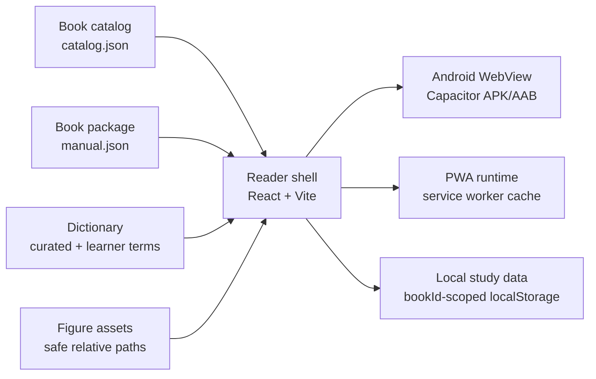
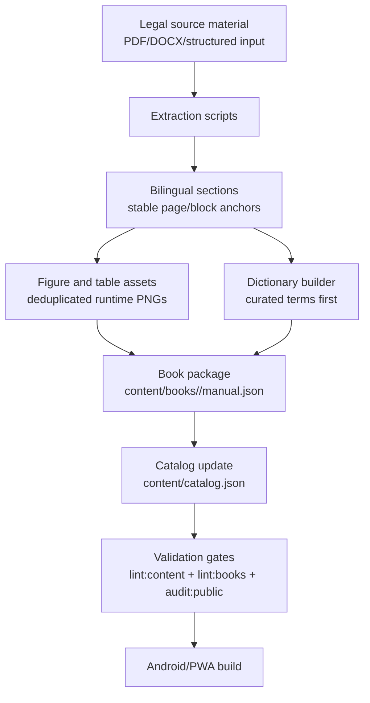
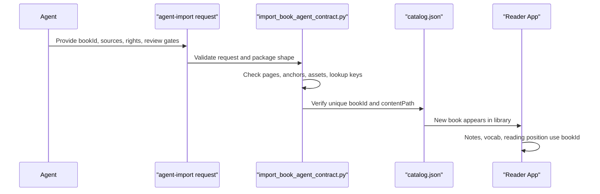

# Showcase Systems

## Product Architecture

Why this is not a PDF viewer:

- The reader consumes structured blocks, not full-page screenshots.
- Every block carries `bookId`, `page`, and `blockId` anchors for language switching and return-to-source.
- Vocabulary, notes, and reading position are scoped by textbook.

## Content Pipeline

The Six Sigma profile remains strict for the 33-chapter manual. The Agent import path adds a generic contract so future legal textbooks can be validated without inheriting the Six Sigma constants.

## Agent Import Interface

The current sample is `agent-import-sample`, a fully synthetic two-chapter book used to prove the contract and runtime path.

## Verification Matrix

| Area | Command / Evidence | Coverage |
| --- | --- | --- |
| Six Sigma content package | `npm run lint:content` | 33 chapters, 449 pages, block page anchors, assets, dictionary lookup uniqueness |
| Agent book contract | `npm run lint:books` | request schema, book package shape, catalog uniqueness, sample import |
| Public safety | `npm run audit:public` | denylisted tracked files, runtime JSON local-path scan |
| Source coverage | `npm run qa:source-coverage` | source TOC anchors, image assets, sampled nonblank source renders |
| Reader UX | `npm run qa:multibook-ux` | notice, home, page search, book-scoped vocab, scroll lock, immersive mode |
| Android key chapters | `npm run qa:android-key-chapters` | Chapters 1, 7, 26, 33, lookup, alignment, image checks |
| Release package | `npm run android:release-apk` and `npm run android:aab` | local signed APK/AAB with runtime content bundled |
